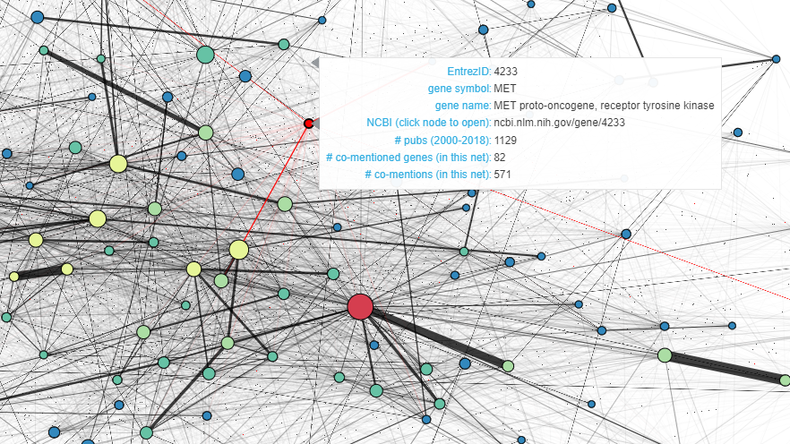

# What is a gene literature network?
#### Reese Richardson, March 29, 2022

Biological researchers often employ networks to describe relationships between an organism's genes at-scale. Common applications of networks include [gene regulatory networks](https://www.nature.com/articles/s41598-018-37667-4) and [gene co-expression networks](https://www.frontiersin.org/articles/10.3389/fgene.2019.01214/full). However, networks can also describe how genes interact **in literature**. 

This project uses [Bokeh](https://docs.bokeh.org/en/latest/) to create interactive **gene literature networks**. These networks describe how often genes are mentioned in the same peer-reviewed academic article. Data is drawn from [gene2pubmed](ftp.ncbi.nlm.nih.gov/gene/DATA/) using [gustav](https://github.com/tstoeger/gustav). The example files generated here include gene literature networks including the 100 most popular genes (i.e. most publications from 2000-2018), the 200 most popular genes, and all cancer-related genes (as annotated in the [COSMIC Cancer Gene Census](https://cancer.sanger.ac.uk/census)). The size of each node/gene corresponds to the number of publications associated with that gene. The color each node/gene corrresponds to the number of times that gene was mentioned alongside other genes. The width of each edge connecting two nodes/genes represent the number of publications in which those genes were mentioned together. Click on a node to open that gene's NCBI page.

To vizualize these networks, download the associated `.html` file. Northwestern University employees can download these files [here](https://nuwildcat-my.sharepoint.com/:f:/g/personal/rar0738_ads_northwestern_edu/Eo3hJJxWhjxFt3_AvF-IufEBmjQKvoJzhEAwl3-tuHqrcw?e=mGRGHR).

*These visualizations were submitted to the 2022 Data Visualization Contest, hosted by Northwestern Information Technology and Northwestern Libraries.*